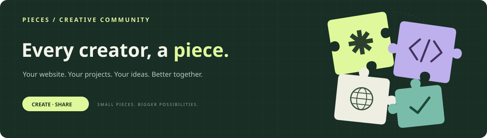

  <a href="https://github.com/Pieces-lab/Join-Pieces/issues/new?template=join.md"><b>Apply to join ↗</b></a> ·
  <a href="#members">Members</a> ·
  <a href="#how-to-join">How to join</a> ·
  <a href="CONTRIBUTING.md">Contribution guide</a> ·
  <a href="README.zh-CN.md">简体中文</a>

This repository lists the members of the organization and serves as the entry point for new applications. Members can share their experiences, projects, and work in a dedicated repository within the organization.

## Why join?

Use your dedicated repository to introduce yourself, showcase your projects and work, and link to your personal website. The member list gives others a way to find you through the organization and discover what you create.

<code>Introduce yourself</code> &nbsp; <code>Share your creations</code> &nbsp; <code>Connect with others</code>

## Members

| Member | GitHub account | Why they joined | Join date |
| --- | --- | --- | :---: |
|  <b>gdemoni</b> | [@gdemoni](https://github.com/gdemoni) | To share my personal website and projects, and connect with other creators. | — |
|  <b>SKYJJGW</b> | [@skyjjgw](https://github.com/skyjjgw) | To share AI applications and automation tools and exchange ideas on practical software projects. | — |

Listed in merge order · Join dates are filled in by the repository owner when merging application PRs · Members can update their entries through PRs

## How to join

| 01 · Apply | 02 · Add your entry | 03 · Open a PR | 04 · Review |
| --- | --- | --- | --- |
| Use the application issue template to introduce yourself and explain why you want to join. | Fork the repository and append your entry to both member tables. | Sync with the latest main, open a PR, and link your application issue. | After the PR is merged, the owner provides a dedicated repository within the organization. |

**[Apply to join Pieces ↗](https://github.com/Pieces-lab/Join-Pieces/issues/new?template=join.md)** &nbsp; · &nbsp; [Read the full contribution guide](CONTRIBUTING.md)

<b>Detailed steps and submission rules</b>

- Open an issue using the [application template](.github/ISSUE_TEMPLATE/join.md). Tell us who you are and why you want to join.
- Fork this repository. Add one row at the bottom of the member table with your name, GitHub profile, and reason for joining. Leave the join date as `—`. Update both the English and Chinese README files.
- Open a PR using the [PR template](.github/pull_request_template.md). Link your application issue with `Closes #123`, replacing `123` with your issue number.
- Before opening your PR and again before it is merged, sync your branch with the latest `main`. Check that existing members are still listed and your row follows the current last member. If another member's PR was merged first, update your branch and resolve any conflict in both README files.
- The repository owner will review your application. After your PR is merged, they will provide a dedicated repository within the organization for your content.

Empty rows are not reserved: simultaneous edits to the end of the table may conflict, and GitHub will not automatically move a later PR's row below a newly merged one.

<b>Example entry (not a real member)</b>

| Member | GitHub account | Why they joined | Join date |
| --- | --- | --- | :---: |
| Your Name | [@your-username](https://github.com/your-username) | I want to share my projects and meet other creators. | — |

## License

The content in this repository is licensed under [CC BY 4.0](LICENSE). Linked personal websites and dedicated member repositories have their own terms.

---

PIECES · Every creator is a piece.

