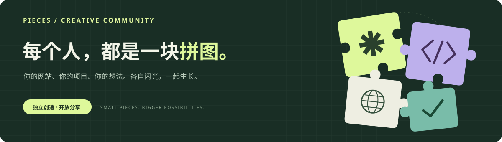

  <a href="https://github.com/Pieces-lab/Join-Pieces/issues/new?template=join.zh-CN.md"><b>申请加入 ↗</b></a> ·
  <a href="#成员名单">成员名单</a> ·
  <a href="#如何加入">如何加入</a> ·
  <a href="CONTRIBUTING.zh-CN.md">贡献指南</a> ·
  <a href="README.md">English</a>

本仓库记录已加入组织的成员，也是申请加入组织的入口。成员可以在组织专用仓库中介绍自己的经历、项目和作品。

## 加入的好处

你可以在组织专用仓库中介绍自己、展示项目和作品，并放上个人网站链接。成员名单也让其他人能通过组织找到你，看到你创作的内容。

<code>介绍自己</code> &nbsp; <code>展示创作</code> &nbsp; <code>连接同好</code>

## 成员名单

| 成员 | GitHub 账号 | 为什么加入 | 加入日期 |
| --- | --- | --- | :---: |
|  <b>gdemoni</b> | [@gdemoni](https://github.com/gdemoni) | 分享个人网站与项目，结识更多创作者。 | — |
|  <b>SKYJJGW</b> | [@skyjjgw](https://github.com/skyjjgw) | 分享 AI 应用与自动化工具，和社区交流可落地的软件项目。 | — |
|  <b>xiaolin</b> | [@linyuchao123](https://github.com/linyuchao123) | 与社区交流、向大家学习，并共同创作 AI、软件开发及开源项目。 | — |

按合并顺序排列 · 加入日期由仓库作者在合并申请 PR 时填写 · 成员可通过 PR 更新自己的记录

## 如何加入

| 01 · 发起申请 | 02 · 添加信息 | 03 · 提交 PR | 04 · 审核收录 |
| --- | --- | --- | --- |
| 使用加入申请模板新建 Issue，介绍自己和加入原因。 | Fork 仓库，在中英文成员表格末尾添加信息。 | 同步最新 main，提交 PR 并关联申请 Issue。 | PR 合并后，由作者提供组织专用仓库。 |

**[申请加入 Pieces ↗](https://github.com/Pieces-lab/Join-Pieces/issues/new?template=join.zh-CN.md)** &nbsp; · &nbsp; [阅读完整贡献指南](CONTRIBUTING.zh-CN.md)

<b>展开详细步骤与提交规则</b>

- 使用[加入申请模板](.github/ISSUE_TEMPLATE/join.zh-CN.md)新建 Issue，介绍自己和想加入组织的原因。
- Fork 本仓库，在成员表格末尾新增一行，填写自己的名字、GitHub 主页和加入原因。加入日期暂时填写「—」。同步更新中英文两份 README。
- 按 [PR 模板](.github/pull_request_template.zh-CN.md)提交 PR，并用 `Closes #123` 关联申请 Issue（将 `123` 换成实际编号）。
- 提交 PR 前、合并前，都要同步最新的 `main`。确认已有成员仍在表格中，自己的记录排在当前最后一位成员之后。如果其他人的 PR 先合并了，请更新分支，并解决两份 README 中可能出现的冲突。
- 仓库作者会查看申请。PR 合并后，作者会为申请人提供一个组织专用仓库，用来持续记录和展示自己的内容。

这里不预留空行：多人同时修改表格末尾时可能发生冲突，GitHub 不会自动把后合并的记录移到新成员下面。

<b>查看填写示例（并非真实成员）</b>

| 成员 | GitHub 账号 | 为什么加入 | 加入日期 |
| --- | --- | --- | :---: |
| 你的名字 | [@your-username](https://github.com/your-username) | 我想分享自己的项目，认识更多创作者。 | — |

## 许可证

本仓库的内容采用 [CC BY 4.0](LICENSE) 许可。成员个人网站及组织专用仓库的内容遵循各自的授权规则。

---

PIECES · 每个人，都是一块拼图。

